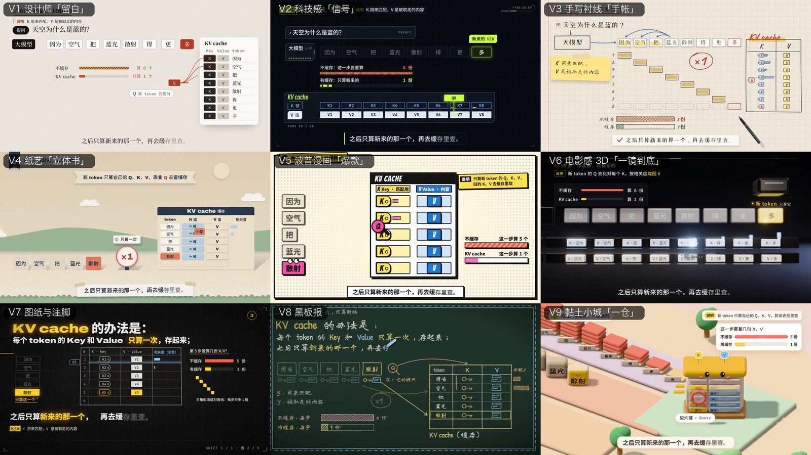

# Choosing an explainer style · 选择讲解风格

Nine styles, one contract: every style turns the same `story.json` into a film with word-timed captions, a chapter
chip, a performed closing line and a one-frame recap. They differ in how the ideas are acted out. All are 16:9,
1920×1080. The picture below is the same moment of the bundled KV cache film in all nine.

九种风格共用一套接口：同一份讲稿（`story.json`）在任何风格里都有逐字字幕、章节条、结尾金句和一帧复习图，区别在于用什么画面把内容“演”出来。全部为横屏 16:9（1920×1080）。下图是同一支 KV cache 讲解片在九种风格里的同一时刻。

| key | 名称 | the look · 画面 | best for · 适合 | 3D |
| --- | --- | --- | --- | --- |
| `v1-editorial` | V1 设计师「留白」 | warm paper, ink, one vermilion accent, data blocks, page turns · 暖白纸、墨色、一抹朱红，大留白 | serious, premium explainers; business and product topics · 严肃、高级感、商业与产品 | no |
| `v2-signal` | V2 科技感「信号」 | dark HUD, acid-lime accent, labels decode in, packets on wires, glitch cuts · 暗色仪表盘、荧光绿、数据包流动 | AI / infra / networking, anything “system-like” · AI、基础设施、网络、系统类 | no |
| `v3-notebook` | V3 手写衬线「手帐」 | grid paper, a live pen writes every word, sticky notes, eraser · 方格纸上真笔书写、便利贴、橡皮擦 | teaching step by step, derivations, study notes · 一步步推导、学习笔记、教学 | no |
| `v4-paper` | V4 纸艺「立体书」 | kraft pop-up book, pieces fold up with soft shadows, parallax · 牛皮纸立体书、折起的纸片、视差 | warm stories, processes, consumer topics · 有温度的故事、流程、大众话题 | no |
| `v5-comic` | V5 波普漫画「爆款」 | halftone comic page, stickers slam on, bursts and sound words · 半调网点漫画、贴纸拍入、爆炸字 | punchy short videos, hot takes, myth vs fact · 节奏快的短视频、观点、辟谣 | no |
| `v6-cinematic` | V6 电影感 3D「一镜到底」 | Three.js one-take in a graphite studio, porcelain props, bloom · 一镜到底的 3D 影棚、瓷质道具、辉光 | flagship pieces, launches, big-picture concepts · 旗舰内容、发布、宏观概念 | yes |
| `v7-drafting` | V7 图纸与注脚 | one black drawing sheet, leader lines, ghost-letter karaoke, true footnotes · 黑色图纸、引线、注脚、卡拉OK式大字 | technical deep dives for practitioners · 面向从业者的技术深挖 | no |
| `v8-chalkboard` | V8 黑板报 | a wooden blackboard written live in chalk, felt eraser, chalk mind map · 木框黑板、粉笔现写、板擦、粉笔脑图复习 | classroom feel, beginners, memory-friendly recaps · 课堂感、入门、便于记忆 | no |
| `v9-clay` | V9 黏土小城「一仓」 | an isometric plasticine town, every analogy labelled with its real term · 等距黏土小城，比喻 + 真实术语标签 | analogies for non-experts, cute and friendly · 用比喻讲给外行、可爱亲和 | yes |

## 风格菜单 · the menu to show a user

Users rarely know the styles before they see them. Send this list (in the user's language) together with the gallery
image above, and mark the two or three that fit their topic:

> 一共九种风格（下图是同一句讲解在九种风格里的样子）：
> 1. **留白**：暖白纸、墨色、一抹朱红，克制高级，适合商业、产品、严肃话题
> 2. **信号**：暗色仪表盘、荧光绿数据流，适合 AI、系统、网络类
> 3. **手帐**：方格纸上真笔现写、便利贴，适合一步步推导、学习笔记
> 4. **立体书**：牛皮纸立体书、纸片折起，温暖，适合讲故事、讲流程
> 5. **波普漫画**：网点漫画、贴纸拍入、爆炸字，节奏快，适合观点、辟谣
> 6. **一镜到底**：3D 影棚一镜到底，有电影感，适合大概念、重磅内容
> 7. **图纸与注脚**：黑色工程图纸、引线和注脚，硬核，适合技术深挖
> 8. **黑板报**：粉笔现写、结尾一张粉笔脑图，课堂感，适合入门、便于记忆
> 9. **黏土小城**：萌系黏土小镇，用比喻讲概念并标出真实术语，适合讲给小白
>
> 拿不准的话，我可以九种都先出一版草稿，你看完再选。

How to choose · 怎么选:

- Unsure? Build all nine as drafts (`tools/new_topic.sh <story>`, a few minutes, no extra API calls once the audio is
  locked, or with `--dry`) and compare them with
  `tools/still_grid.py` — then perform only the one you pick. 拿不准就先九种都出初稿对比，再只把选中的那一种做成成片。
- The 3D styles (V6, V9) render slower and need a GPU-capable Chrome for snapshots; the others are pure DOM.
  3D 风格渲染更慢；其余七种是纯网页元素。
- The styles are 16:9 only for now. If the user asks for vertical (抖音 / 视频号 / 小红书), say so and let them choose:
  a 16:9 styled film, or the presenter route at 9:16 (needs an authorized portrait). Do not switch routes silently.
  目前只有横屏；用户要竖屏时说明限制，让用户在“横屏风格片”和“竖屏数字人（需要授权照片）”之间选，不要擅自换路线。

Common words → styles · 常见说法对应的风格:

| 用户说 | 推荐 |
| --- | --- |
| 手绘 / 手写 / 笔记 / 推导 | V3 手帐（或 V8 黑板报） |
| 黑板 / 粉笔 / 课堂 / 入门 | V8 黑板报 |
| 可爱 / 黏土 / 萌 / 讲给小白 | V9 黏土小城（或 V4 立体书） |
| 科技感 / 赛博 / 数据 / 系统 | V2 信号 |
| 高级 / 极简 / 商务 / 杂志 | V1 留白 |
| 电影感 / 3D / 大片 / 发布 | V6 一镜到底 |
| 漫画 / 爆款 / 有梗 / 辟谣 | V5 波普漫画 |
| 硬核 / 图纸 / 工程 / 技术深挖 | V7 图纸与注脚 |
| 温暖 / 故事 / 纸艺 / 流程 | V4 立体书 |

## Writing the narration for the chosen style · 按风格写稿

Pick the style before the script is locked: each style performs a different kind of sentence well, so write — and
voice — the narration for it. Set the voice speed with `speed:` in `script.md` and the recap with `length:` under
`## recap` (3.5–4.7 s all render cleanly; the default is 4.7). The style's `STARTER.md` shows what a line turns into on
screen.

选定风格后再定稿：每种风格擅长演绎的句子不一样，讲稿和配音要按风格来写。语速写在 `script.md` 的 `speed:`，复习页时长写在
`## recap` 下的 `length:`（3.5–4.7 秒都能完整播完，默认 4.7）。

| 风格 | 讲稿怎么写 | 句子 | 语速 `speed` | 复习页 `length` |
| --- | --- | --- | --- | --- |
| V1 留白 | 冷静、准确，像杂志导语；每句落一个具体对象或数字（比例、计数、对比） | 中短句，少用口语和感叹 | 1.05 | 4–4.5 s |
| V2 信号 | 把概念讲成一个系统：谁输入、经过什么、输出什么；多用“传、查、算、存”这类动词，数字带单位 | 短句，一句一个动作 | 1.1 | 3.5–4 s |
| V3 手帐 | 一步步推导：“先……再……所以……”；适合列步骤、写公式、做对比表 | 中句，节奏稍慢，给笔留出书写时间 | 1.0–1.05 | 4.5 s |
| V4 立体书 | 讲成一个小故事或一条流程，每个环节是一个能“立起来”的东西；可以用“就像……”打比方 | 中句，语气温和 | 1.05 | 4 s |
| V5 波普漫画 | 先抛问题或反常识的结论，再揭晓；适合辟谣、“其实……”、拟声词；一句一个梗 | 很短，尽量每句 15 字以内 | 1.15 | 3.5 s |
| V6 一镜到底 | 句子少而重，适合讲大概念和揭晓时刻；前面铺垫，最后一句落点 | 中长句，句间留出停顿 | 1.0–1.05 | 4 s |
| V7 图纸与注脚 | 用准确术语，数字都带单位，适合补一条行内人才知道的真注脚；一张图讲 1–2 句 | 中句，信息密度高 | 1.1 | 4 s |
| V8 黑板报 | 课堂口吻：“我们来看……”“记住……”；分 3–5 个板块，每块一个要点，结尾总结成一句 | 中句，像老师讲课 | 1.05–1.1 | 4–4.7 s（要点多时取长） |
| V9 黏土小城 | 全程一个比喻世界：每个概念对应一个实物，说出比喻后紧接真实术语（“就像仓库……这就是缓存”） | 短中句，亲切 | 1.1 | 4 s |

Every style's details — tokens, components, idioms, do and don't — are in `kits/<style>/KIT.md` and
`kits/<style>/starter/STARTER.md`; the finished reference films are in `examples/kv-cache/<style>/`.
